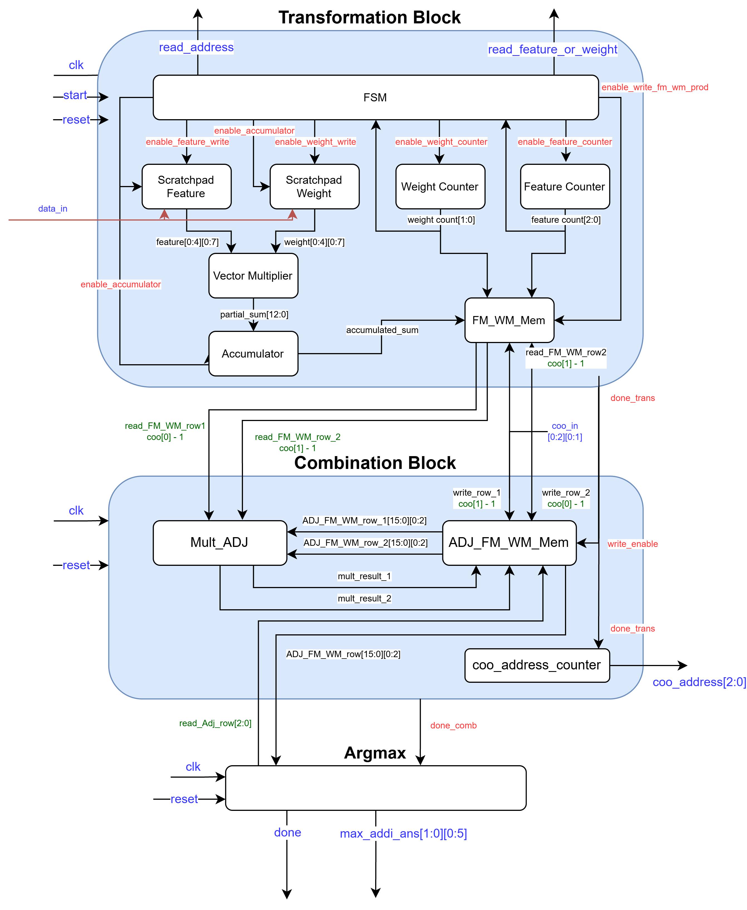
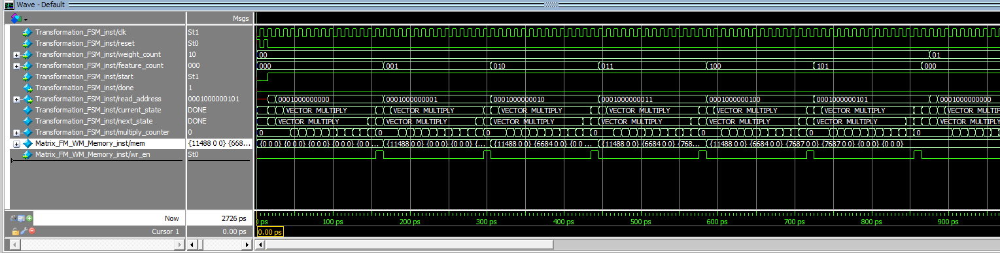
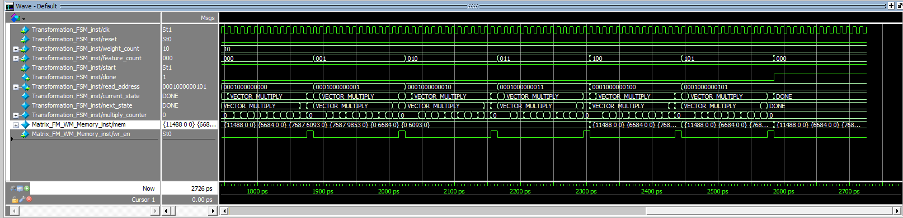
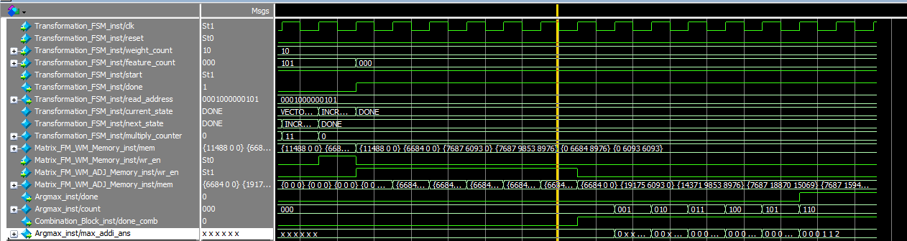

# GCN Hardware Accelerator

This project implements a hardware accelerator for a Graph Convolutional Network (GCN) in Verilog/SystemVerilog.

The accelerator performs feature transformation, sparse graph aggregation, and final node classification using a modular RTL architecture. Sparse graph connectivity is represented using Coordinate (COO) format to avoid unnecessary computation on zero-valued adjacency matrix entries.

The design was developed as part of an ASIC implementation flow targeting synthesis and physical design.

---

## Architecture

The accelerator is organized into three main processing stages:

1. **Feature Transformation**
   - Loads feature and weight data into local scratchpad storage
   - Performs vector multiplication between feature and weight values
   - Accumulates partial products to generate transformed feature vectors
   - Uses an FSM and counters to coordinate memory access and computation

2. **Sparse Feature Aggregation**
   - Uses COO-formatted graph connectivity to identify connected nodes
   - Reads transformed feature rows based on source and destination node indices
   - Accumulates neighboring feature vectors without performing a dense adjacency-matrix multiplication
   - Stores the aggregated feature matrix for classification

3. **Argmax Classification**
   - Reads the final aggregated feature vectors
   - Compares output values for each node
   - Returns the index of the maximum value as the predicted class

### System Diagram



---

## RTL Modules

### Top-Level
`GCN.sv`

Integrates the transformation, sparse aggregation, and classification stages and manages the overall data flow of the accelerator.

### Transformation
`Transformation_Block.sv`

Controls feature transformation and integrates:

- `Transformation_FSM.sv`
- `Scratch_Pad_feature.sv`
- `Scratch_Pad_weight.sv`
- `Vector_Multiplier.sv`
- `Accumulator.v`
- `Feature_Counter.v`
- `Weight_Counter.v`
- `Matrix_FM_WM_Memory.sv`

The transformation stage computes feature-weight products and stores the transformed feature matrix for subsequent graph aggregation.

### Sparse Aggregation
`Combination_Block.sv`

Performs graph aggregation using the sparse COO representation of the adjacency matrix.

Supporting modules include:

- `Mult_ADJ.sv`
- `Matrix_FM_WM_ADJ_Memory.sv`
- `FM_WM_ROW_Counter.sv`

Instead of performing a dense adjacency-matrix multiplication, the aggregation stage processes only graph connections represented in the COO input.

### Classification
`Argmax.sv`

Performs the final classification by selecting the maximum output value for each node and returning its corresponding class index.

---

## Design Highlights

- Modular RTL implementation in Verilog/SystemVerilog
- Hardware acceleration of GCN inference
- Sparse graph processing using COO-formatted adjacency data
- Local feature and weight scratchpad memories
- Parallel vector multiplication
- Accumulation of partial dot products
- FSM-based computation and memory control
- Dedicated transformation and aggregation datapaths
- Hardware argmax classification
- Designed for ASIC synthesis and physical implementation

---

## Simulation Results

The plots below show representative waveforms and intermediate results from the RTL verification process.







---

## Repository Structure

```text
GCN/
├── Data/
│   ├── coo_data.txt
│   ├── feature_data.txt
│   ├── gold_address.txt
│   └── weight_data.txt
│
├── RTL/
│   ├── Accumulator.v
│   ├── Argmax.sv
│   ├── Combination_Block.sv
│   ├── Feature_Counter.v
│   ├── FM_WM_ROW_Counter.sv
│   ├── GCN.sv
│   ├── Matrix_FM_WM_ADJ_Memory.sv
│   ├── Matrix_FM_WM_Memory.sv
│   ├── Mult_ADJ.sv
│   ├── Scratch_Pad_feature.sv
│   ├── Scratch_Pad_weight.sv
│   ├── Transformation_Block.sv
│   ├── Transformation_FSM.sv
│   ├── Vector_Multiplier.sv
│   └── Weight_Counter.v
│
├── results/
│   ├── Transformation_1.png
│   ├── Transformation_2.png
│   └── Combination_Argmax.png
│
├── GCN.png
├── README.md
├── .gitignore
├── Lab4.pdf
└── Data/
```

---

## Dataset

The accelerator operates on three primary inputs:

- **Feature Matrix** — node feature vectors
- **Weight Matrix** — learned transformation weights
- **COO Graph Representation** — sparse source/destination node pairs representing graph connectivity

The expected classification results are provided through the golden output data and are used for functional verification.

---

## Verification

The RTL design is verified by comparing the accelerator's classification output against the expected node classifications.

The verification flow checks:

- Feature and weight data loading
- Feature transformation
- COO-based sparse aggregation
- Intermediate memory operations
- Final argmax classification
- Overall GCN output correctness

---

## ASIC Design Flow

The design is intended for a complete RTL-to-GDSII implementation flow consisting of:

```text
RTL Design
    ↓
Functional Simulation
    ↓
Logic Synthesis
    ↓
Post-Synthesis Verification
    ↓
Placement & Routing
    ↓
Post-Layout Verification
    ↓
Power / Performance Analysis
```

The accelerator was designed with performance and power considerations, including datapath parallelism, sparse graph processing, and controlled data movement.

---

## License

This project is intended for educational and portfolio use.

---

## Author

Your Name
